# Portfolio Management System

Welcome to Ngo Nepal, a WordPress custom-themed website serving as a dynamic hub for positive change in Nepalese communities. Our innovative platform incorporates custom fields, enabling vibrant displays of initiatives in education, healthcare, and environmental sustainability. Seamlessly integrated API functionalities for post management, including creation, updates, views, and deletions, ensure a fluid experience for administrators. Explore our custom pages and intuitive admin panel, crafted for a dynamic, user-friendly system where every aspect of the page is configurable. Empowering us to vividly showcase impactful stories, we aim to foster resilience, hope, and progress in Nepal. Join us on this transformative journey as we commit to making a lasting and meaningful difference.

## Screenshots

### Home Page

1. **Home Page**
   
2. **Home Page Variation 1**
   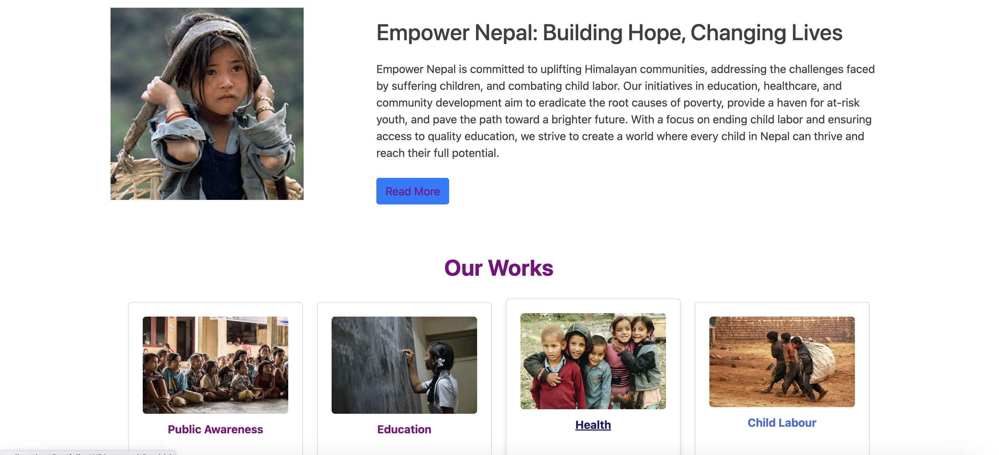
3. **Home Page Variation 2**
   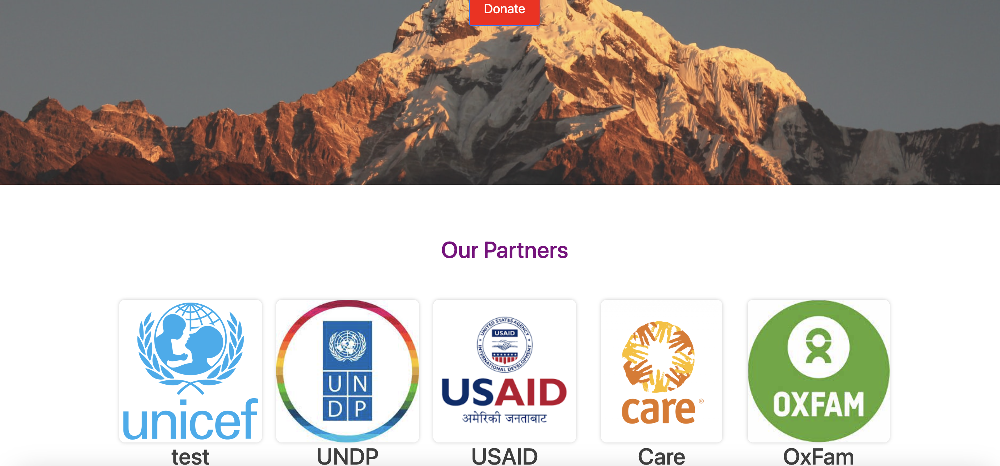
4. **Home Page Variation 3**
   
5. **Home Page Variation 4**
   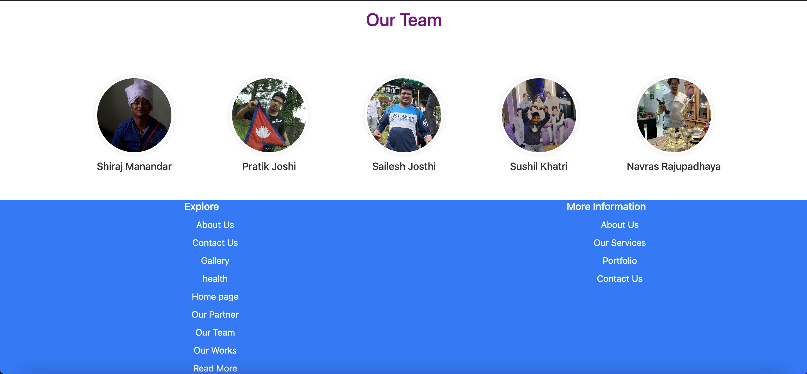

### About Us

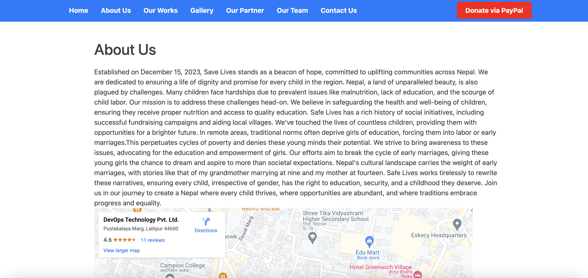

### Our Works

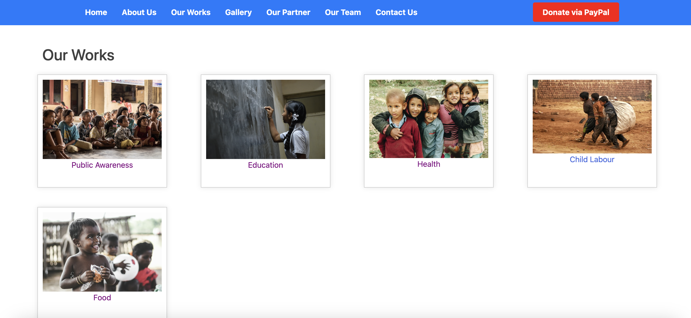

1. **Details Page**
   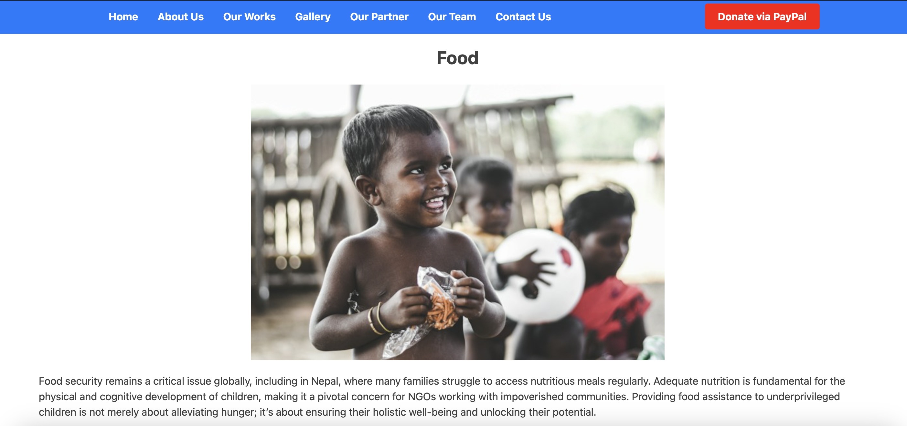

### Gallery

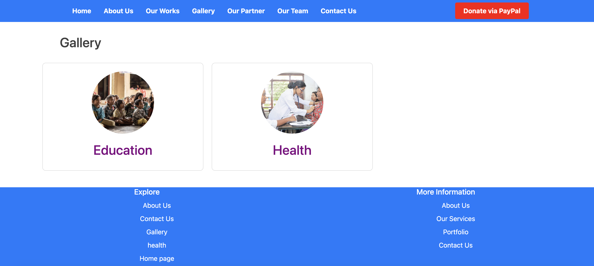

1. **Details page**
   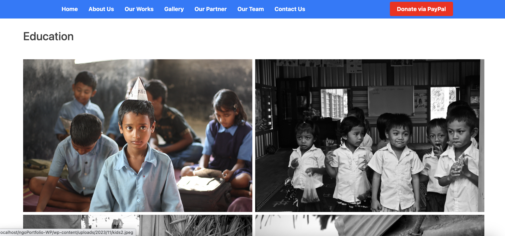

### Our Partners

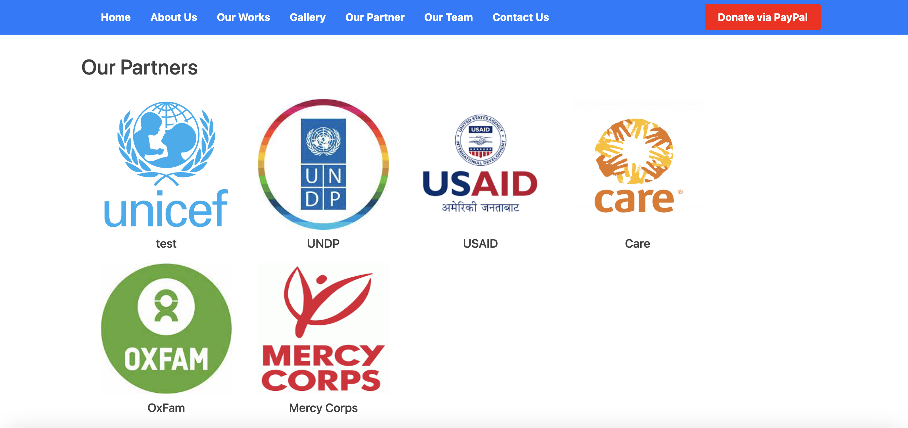

### Our Team

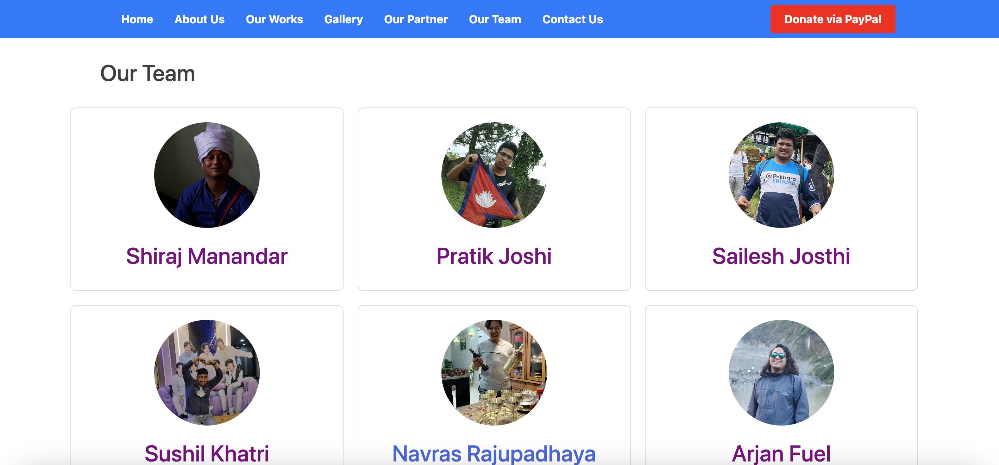

1. **Details Page**
   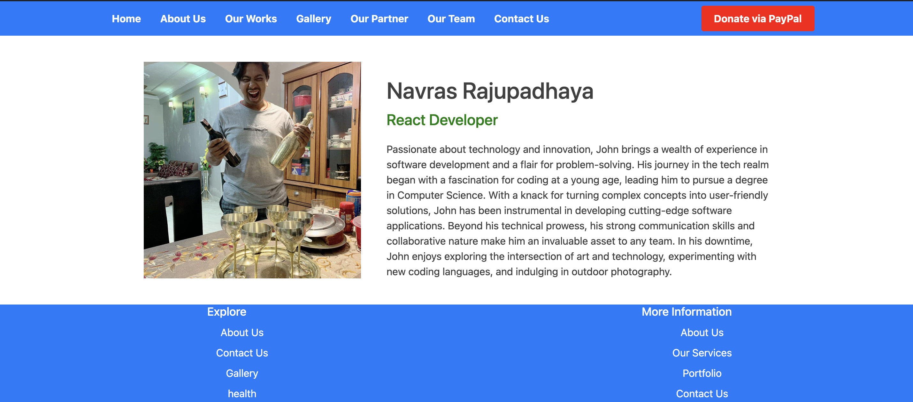

### Contact Us

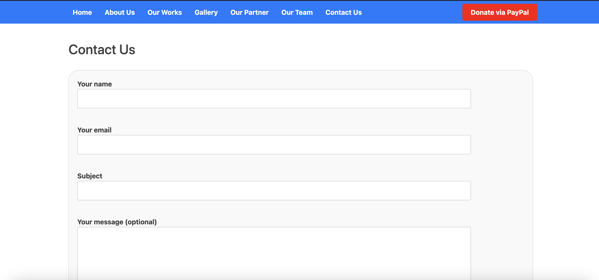

### Donate

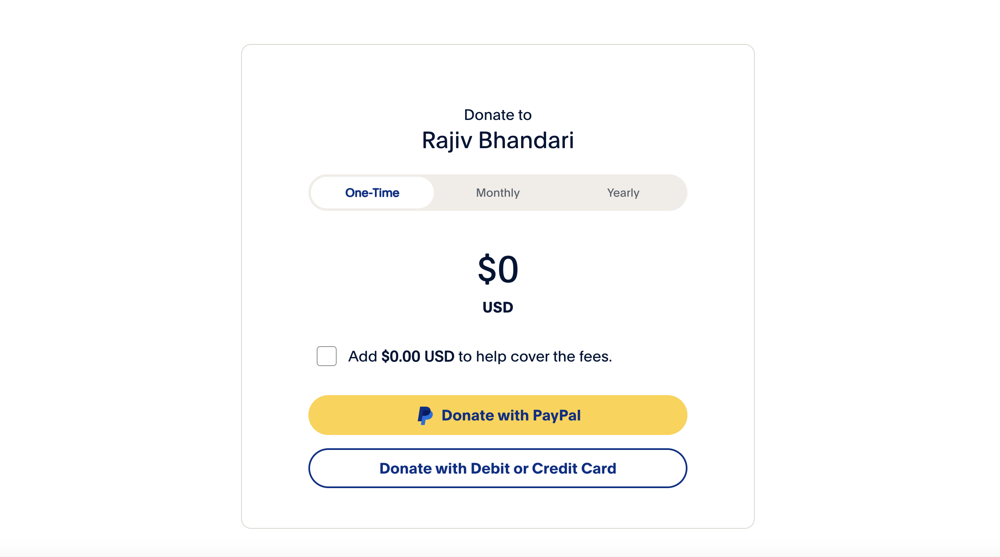
